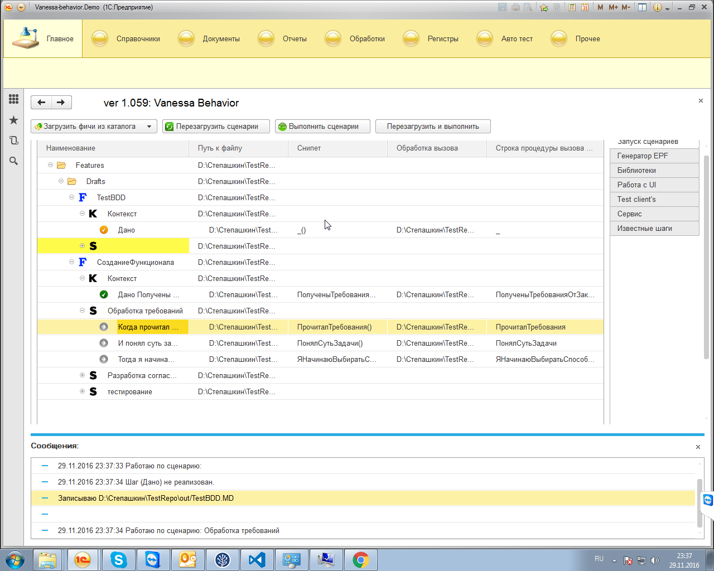
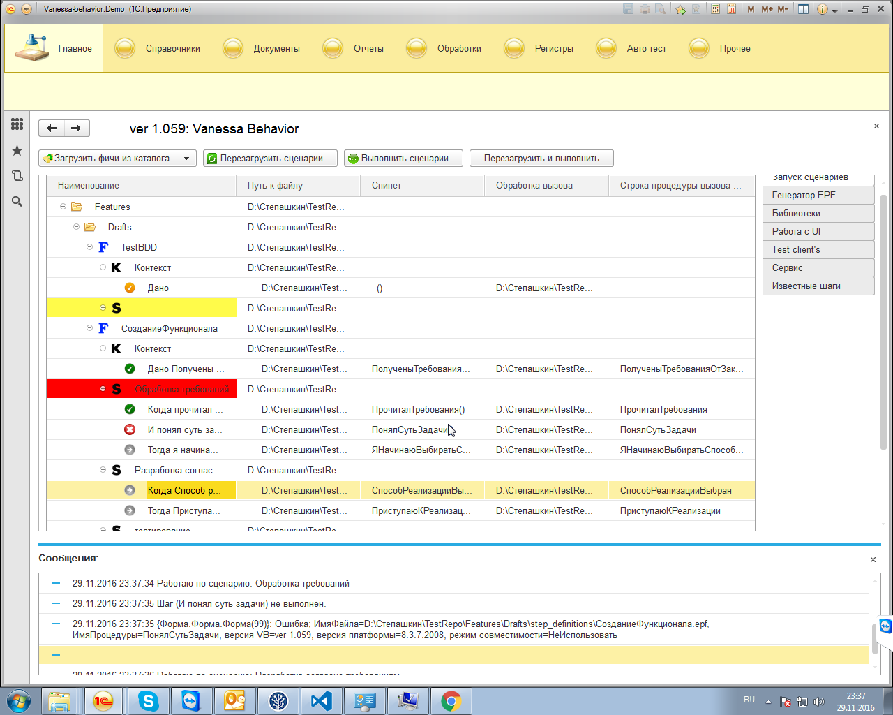

**Функционал:** СозданиеФункционала

> **Как** Разработчик

> **Я хочу** Разработать функционал

> **Чтобы** Функционал работал

**Сценарий:** Обработка требований

	001. Когда прочитал требования

**Сценарий:** Разработка согласно требованиям

	001. Когда Способ реализации выбран

**Сценарий:** тестирование
